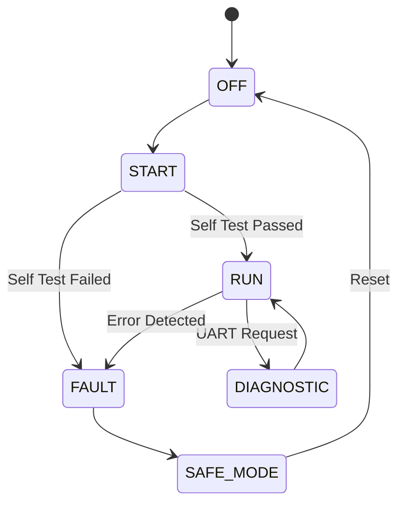

<div align="center">

# 🚗 Mini Automotive ECU

### Embedded Electronic Control Unit using ATmega32

*A layered-architecture embedded system that supervises ignition, monitors vehicle sensors, manages operating states, and protects the system through automatic fault handling.*

</div>

---

## 👥 Team CtrlDrive

| Role | Name |
|---|---|
| Team Leader | **Eng. Hesham Ahmed** |
| Member | Malak Mohammed Ahmed |
| Member | Basmala Mahmoud |
| Member | Maria Boules |

---

## 📖 Overview

The **Mini Automotive ECU** is an embedded application built on the **ATmega32** microcontroller that mirrors the responsibilities of a real vehicle Electronic Control Unit. It walks through a full ignition sequence, continuously reads temperature and battery sensors, drives output actuators via PWM, and escalates through operating states — from OFF to fully diagnosed FAULT recovery — using a clean **layered software architecture** (LIB / MCAL / HAL / APP).

---

## 🎯 Objectives

- [x] Simulate a complete automotive ignition sequence
- [x] Manage multiple operating states reliably
- [x] Read analog and digital sensor inputs
- [x] Drive actuators using PWM
- [x] Detect and classify system faults
- [x] Trigger warning indicators automatically
- [x] Provide live UART diagnostics
- [x] Enforce fail-safe protection logic
- [x] Log fault events for later inspection
- [x] Build a modular, reusable driver architecture

---

## 🧭 Operating States

| State | Mode | Description |
|:---:|---|---|
| ⚪ 0 | **OFF** | Ignition disabled, all outputs off, awaiting ignition command |
| 🔵 1 | **START** | Peripheral init, self-test, and sensor validation in progress |
| 🟢 2 | **RUN** | Normal operation — sensors read, actuators controlled, faults monitored |
| 🟣 3 | **DIAGNOSTIC** | UART-triggered inspection of live status and sensor data |
| 🔴 4 | **FAULT** | Fault detected — outputs protected, system enters safe mode |



---

## 🚨 Fault Codes

| Code | Description |
|:---:|---|
| F001 | High Temperature |
| F002 | Low Battery |
| F003 | Sensor Failure |
| F004 | ADC Error |
| F005 | UART Communication Error |

Every detected fault raises a warning indicator, transmits a UART report, records an event log entry, and locks outputs into a protected state until the system is reset.

---

## 🗂️ Project Structure

```
Mini_ECU/
│
├── APP/
│   ├── main.c
│   ├── ECU.c
│   └── ECU_Manager.c
│
├── HAL/
│   ├── LED/
│   ├── Button/
│   ├── LCD/
│   ├── Sensor/
│   └── Buzzer/
│
├── MCAL/
│   ├── DIO/
│   ├── ADC/
│   ├── UART/
│   ├── TIMER/
│   ├── PWM/
│   └── EXTI/
│
├── LIB/
│   ├── STD_TYPES.h
│   └── BIT_MATH.h
│
└── README.md
```

> **Architecture layers, bottom-up:**
> **LIB** (shared types/macros) → **MCAL** (microcontroller peripherals) → **HAL** (sensors & actuators) → **APP** (ECU control & fault management)

---

## 🩺 Diagnostic Output

Sample UART transmission while the ECU is running:

```
ECU READY
ENGINE RUNNING
TEMP = 42 C
BATTERY = 12.3V
FAULT = NONE
```

---

## 🔌 Peripheral Integration

| Peripheral | Purpose |
|---|---|
| ADC | Temperature & battery voltage reading |
| DIO | LEDs & switch inputs |
| UART | Diagnostics communication |
| Timer | Task scheduling |
| PWM | Motor / fan simulation |
| EXTI | External interrupt handling |

---

## 🛠️ Tools & Technologies

| Tool | Purpose |
|---|---|
| Microchip Studio | Writing, building, and debugging the firmware |
| AVR-GCC | Compiling the embedded C source |
| Proteus | Full hardware circuit simulation |
| Git / GitHub | Version control and collaboration |

---

## 📚 Course Information

**Embedded Systems Diploma**

Topics covered throughout this project:

`Embedded C` · `AVR Architecture` · `ADC` · `DIO` · `Timers` · `PWM` · `UART` · `Interrupts` · `State Machine` · `Fault Handling` · `Driver Development`

---

## 📄 License

This project was developed during the **NTI Embedded Systems Training Program**.

Licensed under the **MIT License**.

**Project Organization:** Gestell

---

## 🙏 Acknowledgment

Special thanks to:

- 🏛️ National Telecommunication Institute (NTI)
- 👨‍🏫 Eng. Hesham Ahmed
- 🤝 Gestell Team

for their support and guidance throughout this project.

---

<div align="center">

*Engineered with 🔧 by Team CtrlDrive*

</div>
