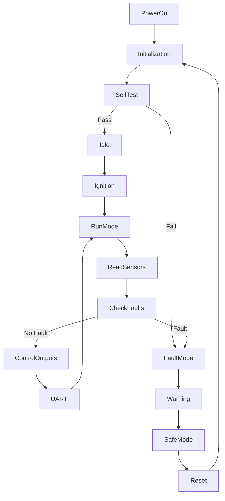
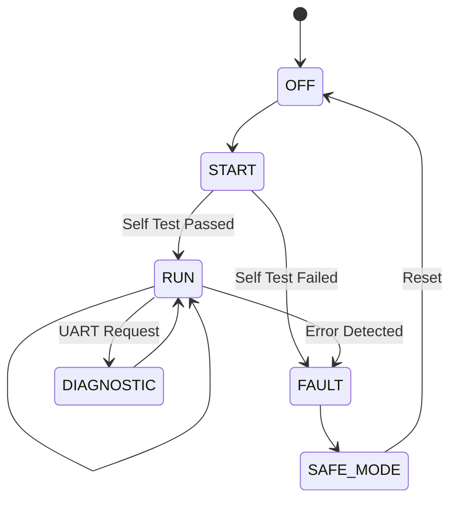
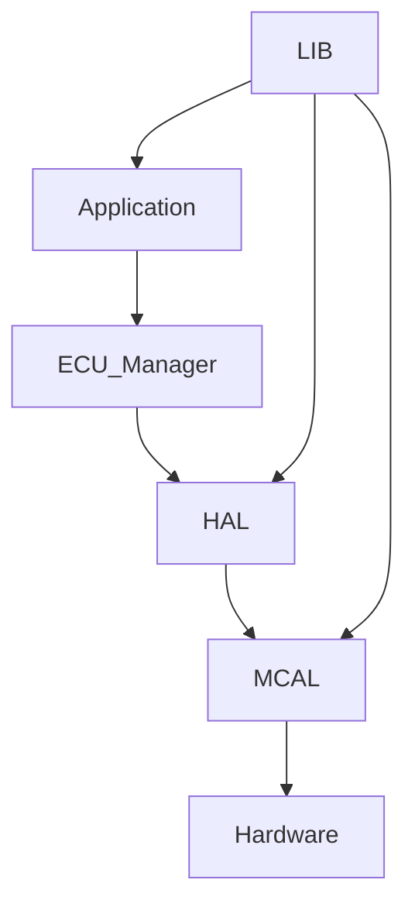
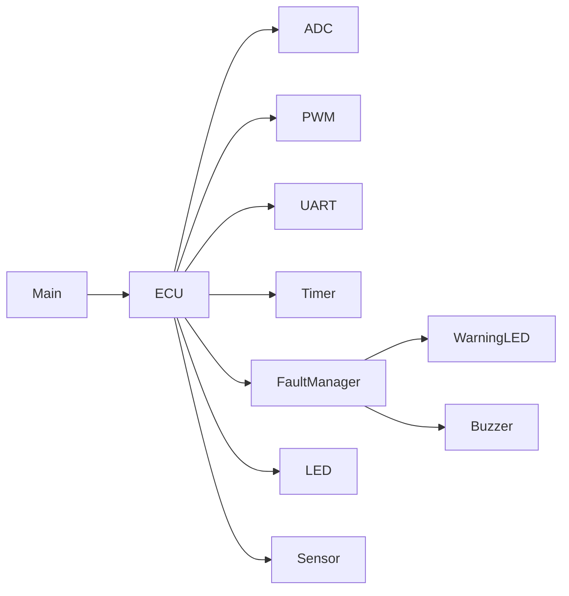

# 🚗 Automotive-Electronic-Control-Unit-Mini-ECU-
### Embedded Systems Final Project

A Mini Automotive Electronic Control Unit (ECU) built using the **ATmega32 AVR Microcontroller** to supervise and manage different vehicle subsystems based on operating conditions, user inputs, and predefined control logic.

The project demonstrates the core concepts of automotive embedded software including state machines, fault management, hardware abstraction, diagnostics, and real-time control.

---

# 📌 Project Overview

Modern vehicles contain multiple Electronic Control Units (ECUs) responsible for monitoring sensors, controlling actuators, detecting faults, and ensuring safe operation.

This project simulates a simplified Automotive ECU capable of:

- Starting the ignition sequence
- Managing different operating modes
- Monitoring vehicle sensors
- Detecting system faults
- Controlling warning indicators
- Communicating diagnostic information over UART
- Protecting the system during abnormal conditions

---

# 🎯 Project Objectives

- Simulate a simplified Automotive ECU
- Build modular embedded software
- Implement State Machine Architecture
- Monitor analog and digital inputs
- Control outputs using PWM
- Detect and report faults
- Implement protection mechanisms
- Support UART diagnostics
- Develop reusable embedded drivers

---

# 📋 Functional Requirements

## Ignition Sequence

The ECU shall perform the following sequence:

1. Power On
2. System Initialization
3. Self Test
4. Sensor Validation
5. Engine Ready
6. Ignition Enabled
7. Normal Operation

If initialization fails, the ECU enters Fault Mode.

---

## Operating Modes

The ECU supports multiple operating modes.

### OFF Mode

- Ignition disabled
- Outputs OFF
- Waiting for ignition command

---

### START Mode

- Initialize peripherals
- Perform self-check
- Validate sensors

---

### RUN Mode

Normal vehicle operation.

Features:

- Read sensors
- Control actuators
- Monitor faults
- Update dashboard
- UART diagnostics

---

### FAULT Mode

Entered when:

- Sensor failure
- Over-temperature
- Low battery
- Invalid operating conditions

Outputs become protected.

---

### DIAGNOSTIC Mode

Available through UART.

Supports:

- ECU Status
- Sensor Values
- Fault Codes
- System Information

---

# 🚨 Fault Detection

The ECU continuously checks for:

- High Temperature
- Low Battery Voltage
- Sensor Disconnection
- Invalid ADC Reading
- Communication Failure

Each detected fault generates:

- Warning Indicator
- UART Report
- Event Log
- Fault Code

---

# ⚠ Warning Indicators

Visual indicators:

- Power LED
- Engine Status LED
- Warning LED
- Fault LED

Optional:

- Buzzer Alarm

---

# 🩺 Diagnostic Interface

UART communication provides:

- ECU Status
- Engine Mode
- Fault Codes
- Sensor Readings
- PWM Duty Cycle
- Operating Mode

Example

```

ECU READY
ENGINE RUNNING
TEMP = 42 C
BATTERY = 12.3V
FAULT = NONE

```

---

# 📈 System Monitoring

Continuously monitor:

- Engine Temperature
- Battery Voltage
- Engine Speed (Simulation)
- Ignition State
- System Timer

---

# 🛡 Protection Mechanisms

The ECU shall:

- Disable PWM on fault
- Stop ignition
- Activate warning indicator
- Enter safe mode
- Prevent unsafe restart

---

# 🔄 Event Handling

Events include:

- Ignition ON
- Ignition OFF
- Mode Change
- Fault Detected
- Fault Cleared
- UART Request
- Timer Overflow
- External Interrupt

---

# 🛠 Hardware Requirements

- ATmega32
- LEDs
- Push Buttons
- Potentiometer
- Temperature Sensor (LM35 Simulation)
- UART (CH340)
- Buzzer
- LCD (Optional)

---

# 💻 Software Requirements

- Microchip Studio
- Proteus
- AVR-GCC
- Git
- GitHub

---

# 📚 Drivers Used

## MCAL

- DIO
- ADC
- UART
- TIMER0
- PWM
- EXTI

---

## HAL

- LEDs
- Buttons
- LCD (Optional)
- Buzzer
- Sensors

---

## LIB

- STD_TYPES
- BIT_MATH
- Common Macros

---

# 📂 Project Structure

```

Mini_ECU/
│
├── APP
│      main.c
│      ECU.c
│      ECU_Manager.c
│
├── HAL
│      LED
│      Button
│      LCD
│      Sensor
│      Buzzer
│
├── MCAL
│      DIO
│      ADC
│      UART
│      TIMER
│      PWM
│      EXTI
│
├── LIB
│      STD_TYPES.h
│      BIT_MATH.h
│
└── README.md

```

---

# 🚗 ECU Operating Flow



---

# 🧠 ECU State Machine



---

# 🏗 Software Architecture



---

# 📊 ECU Module Diagram



---

# 🔌 Peripheral Integration

| Peripheral | Purpose |
|------------|---------|
| ADC | Temperature & Battery Reading |
| DIO | LEDs & Switches |
| UART | Diagnostics |
| Timer | Scheduling |
| PWM | Motor / Fan Simulation |
| Interrupt | External Events |

---

# 🚨 Fault Codes

| Code | Description |
|------|-------------|
| F001 | High Temperature |
| F002 | Low Battery |
| F003 | Sensor Failure |
| F004 | ADC Error |
| F005 | UART Communication Error |

---

# 🚀 Future Improvements

- CAN Bus
- LIN Communication
- AUTOSAR Architecture
- RTOS Scheduling
- EEPROM Fault Logging
- Cruise Control
- Speed Limiter
- Airbag Simulation
- ABS Controller
- Engine Cooling Controller

---

# 📖 Course Information

Embedded Systems Diploma

Topics Covered

- Embedded C
- AVR Architecture
- ADC
- DIO
- Timers
- PWM
- UART
- Interrupts
- State Machine
- Fault Handling
- Driver Development

---

# 👥 Team CrtlDrive

| Name |
|------|
| Malak Mohammed Ahmed |
| Basmala Mahmoud |
| Maria Boules |

---

# 👨‍💼 Team Leader

**Eng. Hesham Ahmed**

---

# 📜 License

This project was developed during the **NTI Embedded Systems Training Program**.

Licensed under the **MIT License**.

Project Organization: **Gestell**

---

# 🙏 Acknowledgment

Special thanks to:

- National Telecommunication Institute (NTI)
- Eng. Hesham Ahmed
- Gestell Team

for their guidance and continuous support throughout this project.

---

# ⭐ Final Note

This Mini ECU project demonstrates the fundamentals of Automotive Embedded Software by integrating multiple peripherals, implementing a robust State Machine, managing faults safely, and applying modular driver-based software architecture.
